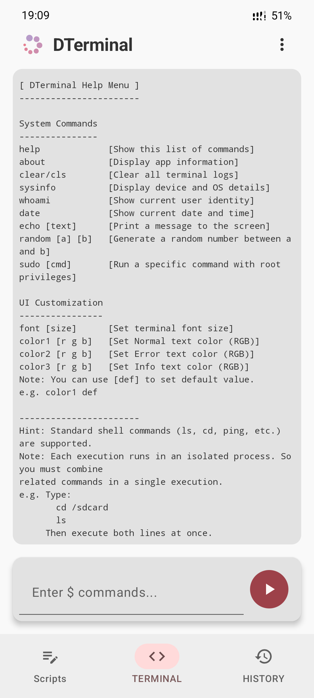
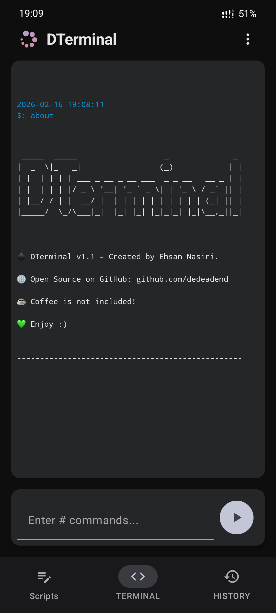

  
  
  
  

# 🍃 DTerminal

A Modern and Customizable Android Terminal Emulator built with Jetpack Compose.

DTerminal is a high-performance terminal emulator designed for Android developers and power users. It provides a clean, reactive interface to interact with the system shell (`sh`) or root shell (`su`), featuring a robust architecture and extensive UI customization options.

## ✨ Features

- 🚀 **Asynchronous Execution**: Powered by Kotlin Coroutines for a lag-free UI.
- 🔓 **Root Support**: Seamlessly switch between standard and root shells.
- 🎨 **Dynamic Customization**: Adjust font size and terminal colors in real-time.
- 💫 **Command History**: Persistent history storage for quick access to previous commands.
- 📜 **Custom Script**: Persistent script storage to save and execute your custom commands easily.
- 🛠 **Internal Commands**: Built-in support for `font`, `color`, `sysinfo` and more.

## 📸 Screenshots

| Light | Dark |
|:---:|:---:|
|  |  |

## 📥 Getting Started

#### Prerequisites

- Android 8.0+ "Oreo"
- (Optional) Root access for su commands

#### Installation

1. Download the latest released APK from the [Releases Page](https://github.com/dedeadend/DTerminal/releases/latest).
2. Install downloaded APK file.
3. Enjoy 💚

## 📌 Note

You might see a Google Play Protect warning while installing the APK. This is common for newly released open-source apps and will be resolved once the app gains more reputation.

## ⌨️ Custom Commands

DTerminal extends standard shell functionality with integrated custom commands:

| Command | Usage | Description |
|---------|-------|-------------|
| `help` | `help` | Show list of custom commands |
| `about` | `about` | Information about DTerminal |
| `clear/cls` | `clear` | Clear all terminal logs |
| `sysinfo` | `sysinfo` | Display device and OS details |
| `whoami` | `whoami` | Show current user identity |
| `date` | `date` | Show current date and time |
| `echo` | `echo <text>` | Print a message to the screen |
| `random` | `random <a> <b>` | Generate a random number between a and b |
| `sudo` | `sudo <cmd>` | Run a specific command with root privileges |
| `font` | `font <size>` | Set terminal font size |
| `color` | `color <r> <g> <b>` | Set terminal text color |

## 🛠 Tech Stack

- **UI**: Jetpack Compose (Material 3)
- **Architecture**: MVVM + Clean Architecture
- **Dependency Injection**: Hilt
- **Database**: Room
- **Concurrency**: Kotlin Coroutines & Flow
- **Build System**: Gradle (Kotlin DSL)

## 🤝 Contributing

Contributions are what make the open-source community such an amazing place to learn, inspire, and create. Any contributions you make are **greatly appreciated**.

1. Fork the Project
2. Create your Feature Branch (`git checkout -b feature/AmazingFeature`)
3. Commit your Changes (`git commit -m 'Add some AmazingFeature'`)
4. Push to the Branch (`git push origin feature/AmazingFeature`)
5. Open a Pull Request

## ♠️Support

You can find me at

  

## ❤️ Donation

If you find this project helpful, you can buy me a coffee

  

## ⚖️ License

Distributed under the GPL-3.0 License. See [LICENSE](LICENSE) for more information.

---

  Developed with 💚 by <a href="https://github.com/dedeadend">dedeadend</a>

